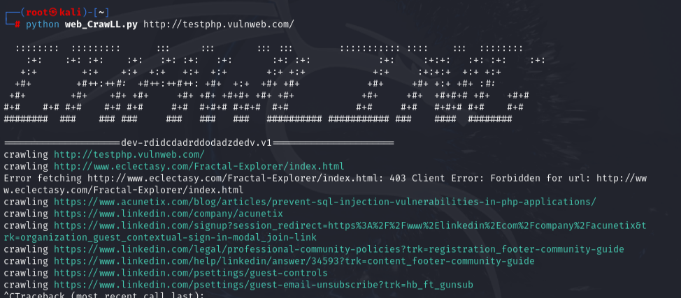

# Web Crawler Python

Este repositório contém um script simples de Web Crawler feito em Python.

## Exemplo da ferramenta

Aqui está uma imagem da ferramenta em funcionamento:



## Instalação

Clone o repositório e instale as dependências com:

```bash
git clone https://github.com/ricardoazev/python-web-crawler.git
cd python-web-crawler
pip install -r requirements.txt
